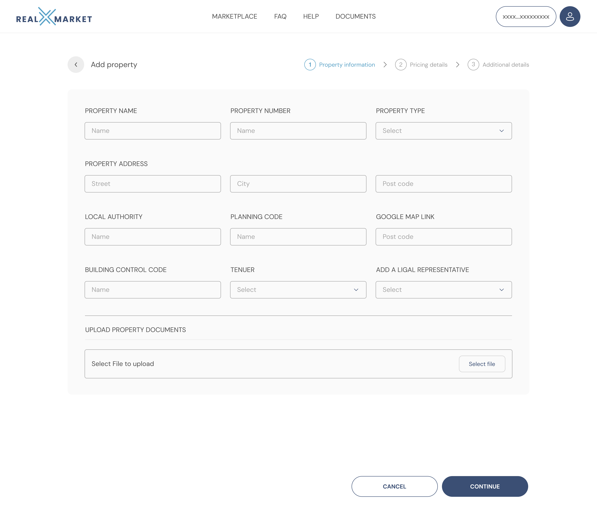

# Real Estate Developer

#### Add company

Enter your company details. These will appear as your company profile on the platform.

<figure><figcaption></figcaption></figure>

#### Add Team

Click the blue 'Add Team' button and follow instructions.

#### Listing a property

Before a property can be listed it must be added to a real estate developer account and be independently verified. A property can be added by a real estate developer, or an authorised member of their team, after receiving an invite link and following the account setup in the general user guide.

#### Adding a property

Click the blue 'Add Property' button and follow instructions to fill in the form.

<figure><figcaption></figcaption></figure>

Once you have completed property information section please press the blue continue button.

