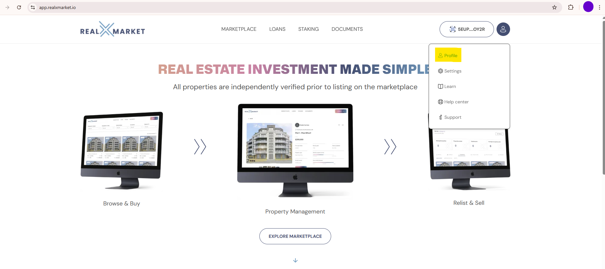

# Investors

1. In exisiting app (version 20/0.1), go to settings where the following page will appear

<figure><figcaption></figcaption></figure>

2. Click on show mnemonics and enter password

<figure><figcaption></figcaption></figure>

3. Take note of the mnemonics and click export json

<figure><figcaption></figcaption></figure>

3. Enter password to Export json

<figure><figcaption></figcaption></figure>

3. Click save realxmarket.json&#x20;

<figure><figcaption></figcaption></figure>

3. Upon first access the app through Google Play Store, uninstall and upgrade button will appear (please excuse the following screenshot showing Open instead of Upgrade):

<figure><figcaption></figcaption></figure>

2. Click Uninstall and the following screen will appear

<figure><figcaption></figcaption></figure>

3. Click Install and the following screen will appear

<figure><figcaption></figcaption></figure>

4. Click Open and the following view will appear

<figure><figcaption></figcaption></figure>

5. Select Import Account and set a new password as shown below

<figure><figcaption></figcaption></figure>

6. Click Continue and arriving at Enter mnemonics screen

<figure><figcaption></figcaption></figure>

7. Mnemonics can be provided to each person.
8. Enter the Mnemonics provided and click Continue will reach the following screen

<figure><figcaption></figcaption></figure>

9. Click create DID&#x20;

<figure><figcaption></figcaption></figure>

10. The following screen will be shown if you explore how to save mnemonics\

<figure><figcaption></figcaption></figure>

11. Saved the mnemonics and Kilt DID on the screen where your DID has been created. Click Continue to reach 'My account' page

<figure><figcaption></figcaption></figure>
