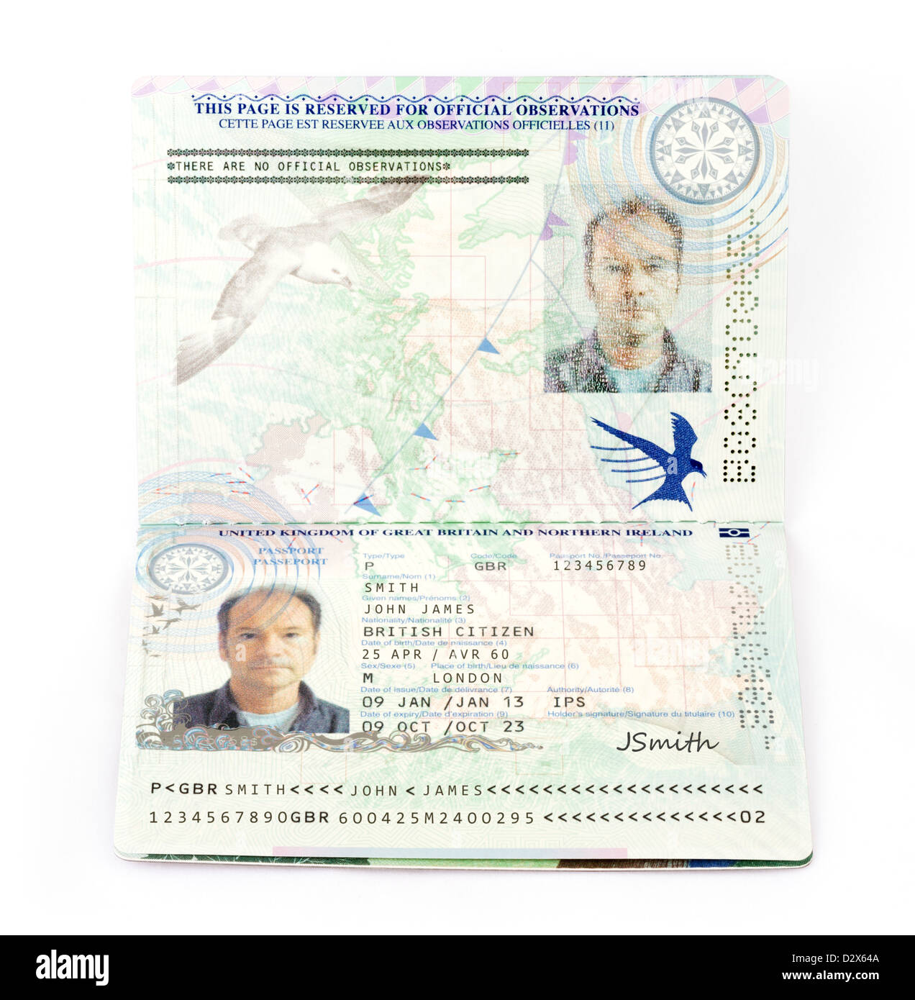
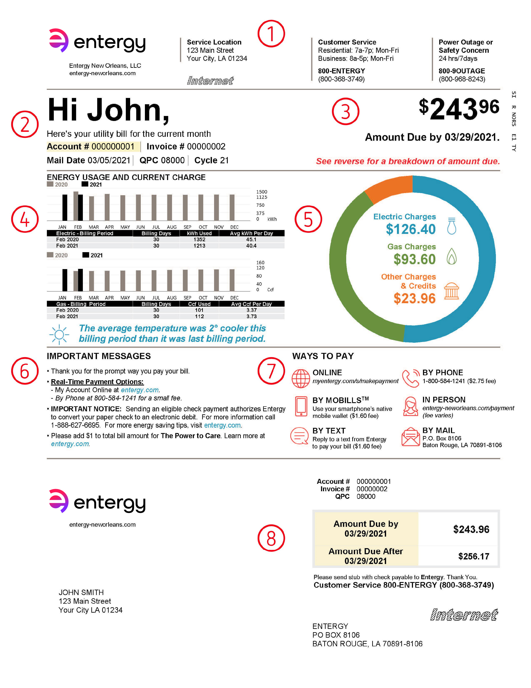

# Testing

#### Risk Questionnaire

The first set of questions are assessing whether you are a High Net Worth Investor. If you answer Yes to either of the first two questions you will be asked to select an amount as a follow up. If you answer Yes to the last question you will be asked a series of additional questions to establish if you are a Professional Investor.

If you deemed to be a suitable investor, then you will be asked if you understand the risks related to being a High Net Worth or Professional Investor. If you click Yes then you will be presented with the terms to scroll and accept before progressing. If you are not deemed to be suitable, then you will receive a message saying this and not be able to progress any further.

#### Sumsub KYC

When you are asked to supply your passport and proof of address please use these test documents rather than your own actual documents.

<figure><figcaption></figcaption></figure>

<figure><figcaption></figcaption></figure>
