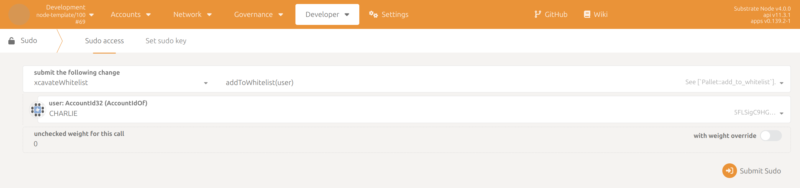
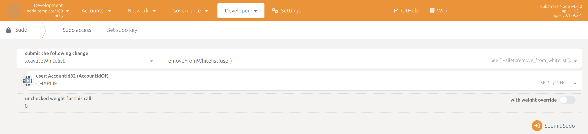

# Whitelist Pallet - Testing

#### Whitelist pallet testing with polkadot js as frontend

The whitelist pallet allows us to add and remove accounts from the whitelist. This is a short term fix until the Kilt DIP Pallet is fully integrated and tested. To interact with our custom pallets, all user must have already gone through the DID/KYC/KYB/AML (Kilt DID & Deloitte Verifiable Credentials) process (and be whitelisted) in order to be able to call the extrinsics of the pallets.

**1.0 Add accounts to the Xcavate whitelist**

To add an account to the whitelist, the sudo account must call the addToWhitelist function.

This function only requires the AccountId of the user to be added to the whitelist as a parameter.

<figure><figcaption></figcaption></figure>

\
**2.0 Remove accounts on the Xcavate whitelist**

To remove an account from the whitelist, the sudo account must call the removeFromWhitelist function.

This function only requires the AccountId of the user to be added to the whitelist as a parameter.

<figure><figcaption></figcaption></figure>
