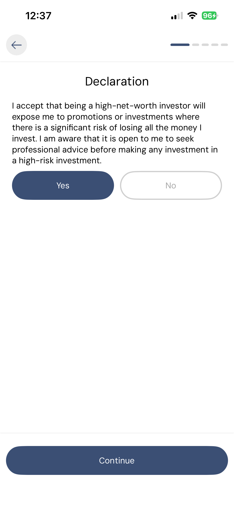

# Getting started

While the application can be accessed on both web browser as well as mobile, all transactions need to be approved through verification of the users identity. Connecting your mobile through scanning a simple QR code makes the connection seamless and secure.

### Web

Using any web browser you can access the realXmarket platform. Access is limited to browsing the marketplace, FAQ, Help and Docs unless you have completed the verification process to create your account.

<figure><figcaption></figcaption></figure>

### Connecting mobile

Once you have downloaded the mobile app from either Google or Apple depending on your device, you can then connect with the web browser by clicking the "Connect" button in the top right of the screen.

<figure><figcaption></figcaption></figure>

### Mobile

When the application first loads you are presented with a risk warning and a number options.

<figure><figcaption></figcaption></figure>

### Create account

Before your full account can be active you will need to fill in some details and successfully pass KYC / AML and risk questionnaire.

#### Create account password

You will need to create a unique password between 6-20 characters

<figure><figcaption></figcaption></figure>

#### Select user role

To initiate the KYC / AML process you will need to select your user role by clicking on the most relevant button.

<figure><figcaption></figcaption></figure>

#### Enter information

Your email is used to send you the code to start the KYC process.

<figure><figcaption></figcaption></figure>

#### Risk Warning & Questionnaire

You will initially be presented with a questionnaire to assess your suitability to property investment.

<figure><figcaption></figcaption></figure>

There are two potential outcomes;

Fail: Message displayed that indicates property investment is not suitable for you.

Pass: Shows a declaration which you need to accept if you wish to proceed to creating your account.

<figure><figcaption></figcaption></figure>

Once you click accept to the declaration you will automatically move the the next stage to accept the privacy, terms and agreement.

#### Privacy, Terms & Agreement

Once you have successfully passed KYC will be asked to accept each document after you have read and scrolled to the bottom of each PDF.

Once all documents have been digitally signed you will be sent to My Account, which maybe different based on the type of user you are.

Choose the user type that best describes your role.

### KYC / AML & Liveness

This is carried out through a third party SumSub app

### General

**Banner**: A security warning advising users of the financial risks involved. Clicking the “Take 2 mins to learn more” link opens a page with the details about the full risks associated with this type of investment.

* **Top Right Icons**:
  * **Notifications** – View important alerts or updates about any of the properties you have invested in.
  * **QR Scanner** –  For scanning account addresses or QR codes.
  * **Menu** – Opens the app’s extended menu or settings.

### My Account

* **Track Investment Summary** at a glance.
* **Click the Balance arrow** to view a summary of your shares, manage your account and payment integration options.
* **Navigate using the Bottom Tabs**:
  * **My Account** – Access your personal profile and app settings.
  * **Help** – Get app support or create a support ticket.
  * **Marketplace** – Browse and invest in real estate property shares.

### Settings

The **Settings** section lets you manage your account's security, account credentials and access helpful links. Here's how to navigate and use each option:

#### Show Mnemonics

This is your **secret backup phrase** used to restore your account. It’s super important.

* Tap on **"Show mnemonics"**.
* You’ll be asked to confirm your identity (Face ID/Passcode or similar).
* Once unlocked, you’ll see your **mnemonic phrase** (usually 12 or 24 words).
* **Write it down somewhere and store it in a secure place** — don’t screenshot or share it.

⚠️ If you lose your phone and don’t have this phrase, **you’ll lose access to your account permanently**.

#### Manage DID

This section allows you to view and manage your **Decentralized Identifier (DID)**, which is used to link your communications, documents and investments.

Here’s how to understand and use each part of this screen:

#### DID Mnemonics

These 12 words (e.g., “flat high label mobile...”) act as your **backup** for the DID. If you ever need to recover your DID, these mnemonics are what you’ll use.

* Tap the **“Manage DID”** section from the **Settings** menu.
* You’ll see your **DID Mnemonics** displayed in a sentence-like list.
*   **Write these down and store them somewhere safe.**

    > ⚠️ Just like wallet mnemonics, if you lose these, your identity is gone for good.

#### What are mnemonics?

Not sure what these words are for?

* Tap on **“What are mnemonics?”**
* You’ll be taken to a helpful explanation (or possibly a link) that breaks it down for you.
* This is great for new users who’ve never interacted with a digital identity before.

#### What are DIDs?

DIDs are how Web3 apps recognise you — like a **secure digital ID**.

* Tap on **“What are DIDs”**
* This provides a beginner-friendly explanation of how DIDs work, how they’re used in realXmarket, and why they matter.

Understanding your DID means better control over your personal data and how it’s used.

#### Delete DID

If you ever want to **remove your identity** from the app:

* Tap **“Delete DID”** (⚠️ the red button at the bottom).
* Confirm that you understand this will **delete your DID permanently**.
* Your identity is now removed from the app.

#### Log Out (Delete Private Key)

This will **log you out** and permanently remove your wallet from the device.
