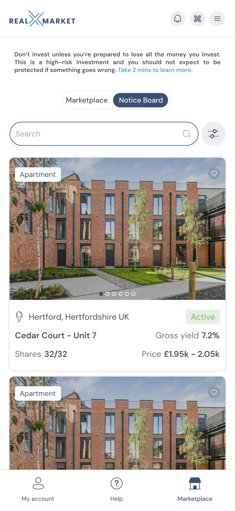
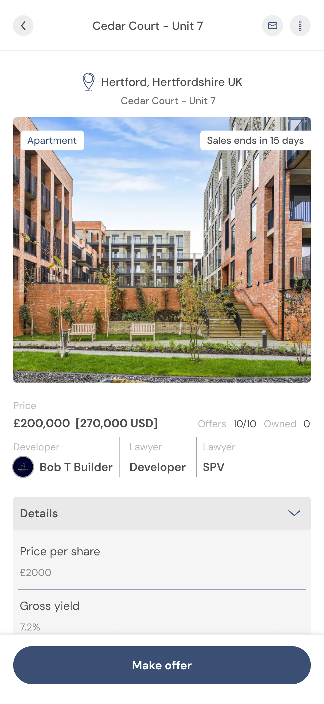

# Investor Resale

### Seller

#### Re-list property shares

If you wish to re-list the property shares once the initial 90 day lock-in period expires after the primary listing sale. You can do so by clicking the re-list shares button to have the property share display on the noticeboard.

<figure><figcaption></figcaption></figure>

<figure><figcaption></figcaption></figure>

Interested parties express interest in your shares through the realXmessenger app where you negotiate a sale price one to one.

<figure><figcaption></figcaption></figure>

<figure><figcaption></figcaption></figure>

### &#x20;Buyer

Buyers browse the noticeboard and click to make offer on any of the property shares they are interested in. Buyers then manage the conversations with sellers using the realXmessenger app where you negotiate a sale price one to one.

<figure><figcaption></figcaption></figure>

<figure><figcaption></figcaption></figure>

<figure><figcaption></figcaption></figure>
