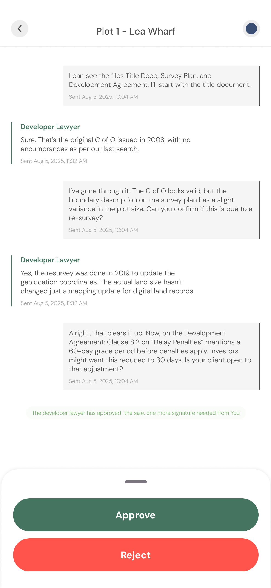

# Lawyer

### Mobile

#### My account

This is where you can see your account key metrics.

* **Core Stats**:
  * **Properties claimed** – The total number of properties you have successfully claimed.
  * **Property sales** – The cumulative amount of your property sales completed.
  * **Average completion** – The average number of days a sale takes to complete.
  * **Total income** – Your income from sales fees.
* **Newly listed**: These are properties that have been fully reserved and are ready to start the sales process.
* **Claimed**: These are properties you have claimed and are awaiting approval by the SPV shareholders
* **Under instruction**: These are properties you are representing in a sale purchase.

<figure><figcaption></figcaption></figure>

 

### Lawyer property claim

Verified lawyers can now claim the property to represent the SPV. Before a lawyer is appointed by the SPV the shareholders need to vote for a particular lawyer and accept their terms.

<figure><figcaption></figcaption></figure>

<figure><figcaption></figcaption></figure>

<figure><figcaption></figcaption></figure>

#### **Property sale process**

The status of the interaction between the SPV lawyer and the Real Estate Developer lawyer can be monitored by the SPV shareholders.

<figure><figcaption></figcaption></figure>

<figure><figcaption></figcaption></figure>

#### **Property sale outcome**

Legal process completed and sale concluded. Funds are sent to Real Estate Developer. Fees sent to Lawyer and Regional Operator. 
