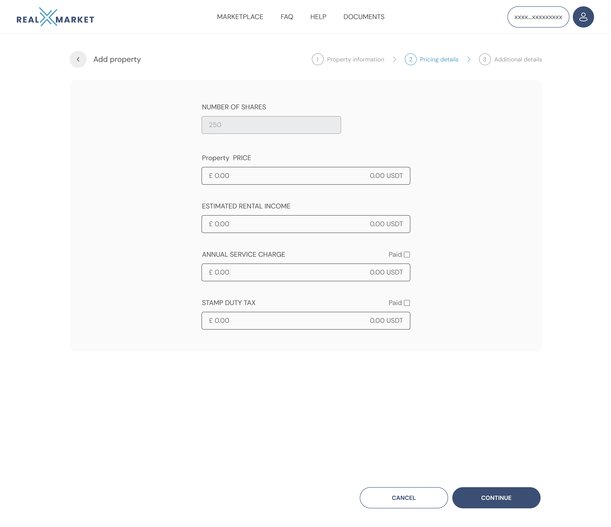
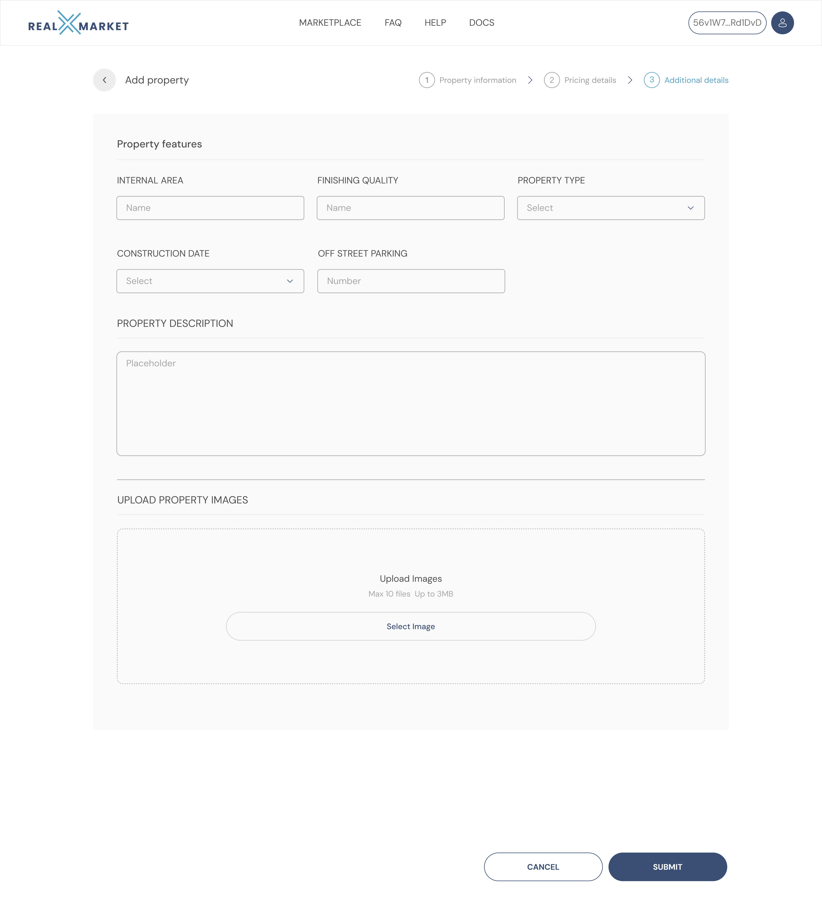

# Real Estate Developer

### Web

Once you have connected your verified mobile account with your preferred web browser (see getting started) you will be able to interact with your account through the browser.

#### Add company

Enter your company details. These will appear as your company profile on the platform.

<figure><figcaption></figcaption></figure>

#### Add Team

Click the blue 'Add Team' button and follow instructions.

#### Listing a property

Before a property can be listed it must be added to a real estate developer account and be independently verified. A property can be added by a real estate developer, or an authorised member of their team, after receiving an invite link and following the account setup in the general user guide.

#### Properties

This is where you will see the current selection and states of any of your properties.

<figure><figcaption></figcaption></figure>

#### Adding a property

Click the blue 'Add Property' button and follow instructions to fill in the form.

<figure><figcaption></figcaption></figure>

Once you have completed property information section please press the blue continue button (pressing cancel saves the property details in the drafts section).

Fill out the Pricing details section and click the blue continue button.

<figure><figcaption></figcaption></figure>

Fill out the Additional details section and click the blue continue button.

<figure><figcaption></figcaption></figure>

Once all sections and information has been completed. Click the blue Submit button so the property can be verified.

<figure><figcaption></figcaption></figure>
