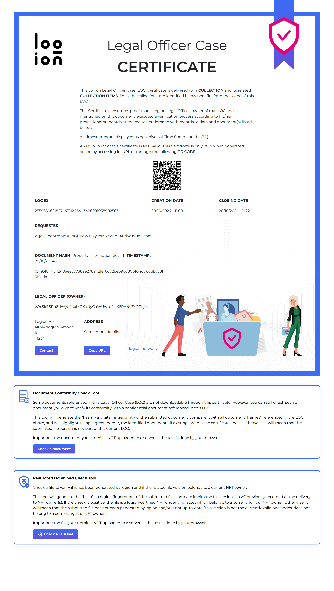

# Logion

**1.0 Create a Digital Identity**

Initially we created an identity based on a real estate developer

\* **add a screenshot** \*

**1.1 Verify Digital Identity**

The identity then needs to be verified by a legal officer

\* **add a screenshot** \*

**2.0 Create a collection**

A verified digital identity can then create a collection. This contains the data on the asset as well as associated documents.

<figure><figcaption></figcaption></figure>



**2.1 Add property documents**

Both public and private documents can be added to the collection

\* **add a screenshot** \*

**3.0 Legal officer reviews the documentation**

The appointed legal officer then reviews the documentation.

\* **add a screenshot** \*

**4.0 Certificate issued**

If all checks pass then a legal officer certificate is created.

<figure><figcaption></figcaption></figure>
