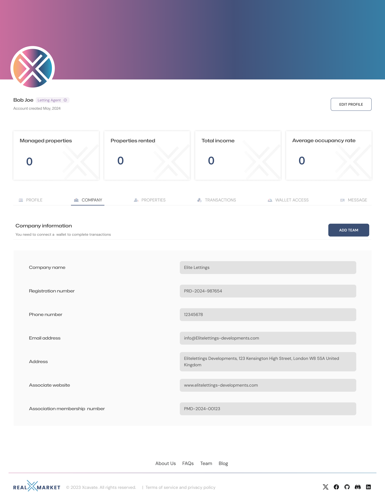

# realXmarket user journey

Any page users land on will direct them to having the correct credentials. For the purpose of this documentation we have used the homepage to start their journey. This page explains the purpose of the dApp and the key stages throughout the process.

**1.0 User Verification**

To interact with the realXmarket dApp, all users must have already gone through the DID/KYC/KYB/AML process (through a regulated verifiable provider) in order to be able to call any function or submit any transaction.

<figure><figcaption></figcaption></figure>

**1.1 Digital Identifier (DID) creation**

If it is the users first time to the application they will need to create a new DID. The DID is like an account reference code that will be used to record all data relating to the users account.

**1.2 Know Your Customer (KYC) / Know Your Business (LYB) / Anti Money Laundering (AML) checks**

In order to be regulatory compliant all users must complete a process that verifies the users personal (and business) data. Once completed, verifiable credentials will be stored on the users device and presented when required to perform specific tasks.

Watch this video to understand the process for the personal identity check.



Watch this video to understand the process for the business identity check.



Once you have these credentials then when you log on you will be asked to present your credentials. This all happens without any need to share any actual documents, so none of your personal data is ever stored on the realXmarket app..

<figure><figcaption></figcaption></figure>

**1.3 Issues with your DID or credentials**

If you are unable to connect for whatever reason please raise a support ticket with our help desk.

\
**2.0 User Accounts**

There are currently four types of user accounts. If a user type button is clicked for the first time, then the user is prompted to connect / create a Digital Identifier (DID), which is attributed to their user account. Once a DID has been set then a user needs to pass an independent KYC & AML process through an accredited partner.

A returning user will simply be logged in and directed to their profile.

<figure><figcaption></figcaption></figure>

**2.1 Real Estate Developer**

Once the user account button has been clicked, then an account is created, which corresponds with a user DID.

\
The account creator can add a company DID and other team mates. Once a company DID has been set then the company needs to pass an independent KYB & AML process through an accredited partner.

<figure><figcaption></figcaption></figure>

**2.1.1 Adding a property**

A real estate developer can add a property by clicking the "add property" button and filling in the form.&#x20;

A partially completed form will be saved and can be edited at any time.

Once all the fields have been completed and the "list" button clicked the property will be verified using several preconfigured oracles.

If there is a problem then a field may need to be amended prior to resubmitting.

If all checks have passed, then the property will appear in the marketplace and the property tokens are available to be purchased.

<figure><figcaption></figcaption></figure>

**2.2 Real Estate Investor**

Once the user account button has been clicked, then an account is created, which corresponds with a user DID.

<figure><figcaption></figcaption></figure>

**2.3 Letting Agent**

Once the user account button has been clicked, then an account is created, which corresponds with a user DID.

\
The account creator can add a company DID and other team mates. Once a company DID has been set then the company needs to pass an independent KYB & AML process through an accredited partner.

<figure><figcaption></figcaption></figure>

**2.3.1 Letting process**

Once the SPV has been created a verified letting agent can "claim" the property and rent it out on behalf of the property token holders SPV.

<figure><figcaption></figcaption></figure>

**2.4 Legal Representative**

Once the user account button has been clicked, then an account is created, which corresponds with a user DID.

\
The account creator can add a company DID and other team mates. Once a company DID has been set then the company needs to pass an independent KYB & AML process through an accredited partner.

\*\*\* add screenshot of lawyer account \*\*\*

**2.4.1 Claiming property**

Once the SPV has been created then all verified lawyers can claim a property to represent either the real estate developer or the SPV but not both at the same time.

**2.4.2 Review Property Documentation**

Both lawyer review the property documentation and vote to complete the sale through the exchange of contracts.

**2.4.3 Distribution of funds and tokens**

Once the vote has been cast and both lawyers have voted to complete the transaction, then all the property tokens are distributed to the investors and the funds are distributed to the real estate developer (less fees and taxes).

Should the vote not be agreed, then the funds are returned to the investors and the property tokens are burnt.

**3.0 NFT Marketplace**

All the properties listed (passed price, ownership & planning permission Oracle checks) appear on the marketplace.

<figure><figcaption></figcaption></figure>

**3.1 Explore property details**

Each individual property can be clicked on to expand on its full details.

<figure><figcaption></figcaption></figure>

**3.2 Purchase property tokens**

Once an investor has made a decision to purchase some property tokens they click the "buy" button and select the number of tokens they wish to purchase.

<figure><figcaption></figcaption></figure>

**3.3 Property token sale**

If its the first time the property has been listed, then all of the property tokens will need to be purchased before the Special Purpose Vehicle (SPV) can be created.

**3.4 Property token refund**

Should all of the tokens not be sold within a specified time period (initially set at 30 days). Then the funds will be returned to the buyers and the tokens burnt.

**4.0 Legal process**

Once the last property token(s) have been purchased an API creates a Special Purpose Vehicle (SPV), which is a Limited Liability Partnership (LLP), this is the legal entity that owns the property. All the property token holders are the legal partners in that company and can vote on all property ownership based decisions.

**5.0 Property Management**

Contracts are electronically signed between the Letting Agent and the SPV.

**5.1 Rental income distribution**

The first months rental for a property (less fees) is deposited by the letting agent. The is to be used as a SPV treasury fund to pay for costs relating to the day to day running of the property. All other months rental income is to be distributed to the property token holders wallets based on the number of tokens they hold.

**5.2 Property voting**

All property token holders based on their token holding can vote on all decisions of the property management over and above a pre-determined threshold (initially set to £500).

A property token holder can propose a vote based on certain criteria.

**6.0 Secondary Market**

Any property token holder can re-list the property tokens back on to the realXmarket within the pre-determined lower and upper price band based on current market value.

Potential buyers can then make offers to the seller.

The sale is concluded once an offer has been accepted by the seller.
