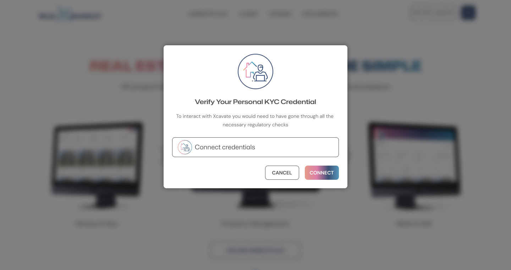

# realXmarket user journey

Any page users land on will direct them to having the correct credentials. For the purpose of this documentation we have used the homepage to start their journey. This page explains the purpose of the dApp and the key stages throughout the process.

**1.0 User Verification**

To interact with the realXmarket dApp, all users must have already gone through the DID/KYC/KYB/AML process (through a regulated verifiable provider) in order to be able to call any functions or submit any transactions.

<figure><figcaption></figcaption></figure>

<figure><figcaption></figcaption></figure>

\
**2.0 User Accounts**

There are currently four types of user accounts. If a user has passed KYC, KYB & AML then they choose an account type.

<figure><figcaption></figcaption></figure>

**2.1 Real Estate Developer**

Once the user account button has been clicked, then an account is created, which corresponds with a user DID.

\
The account creator can add a company DID and other team mates.

<figure><figcaption></figcaption></figure>

**2.11 Adding a property**

A real estate developer can add a property by clicking the "add property" button and filling in the form. A partially completed form will be saved and can be edited at any time.

Once all the fields have been completed and the "list" button clicked the property will be verified.

If there is a problem then a field may need to be amended prior to resubmitting.

**2.2 Real Estate Investor**

Once the user account button has been clicked, then an account is created, which corresponds with a user DID.

**2.3 Letting Agent**

Once the user account button has been clicked, then an account is created, which corresponds with a user DID.

\
The account creator can add a company DID and other team mates.

<figure><figcaption></figcaption></figure>

**3.0 NFT Marketplace**

All the properties listed (passed price, ownership & planning permission Oracle checks) appear on the marketplace.\\

<figure><figcaption></figcaption></figure>
